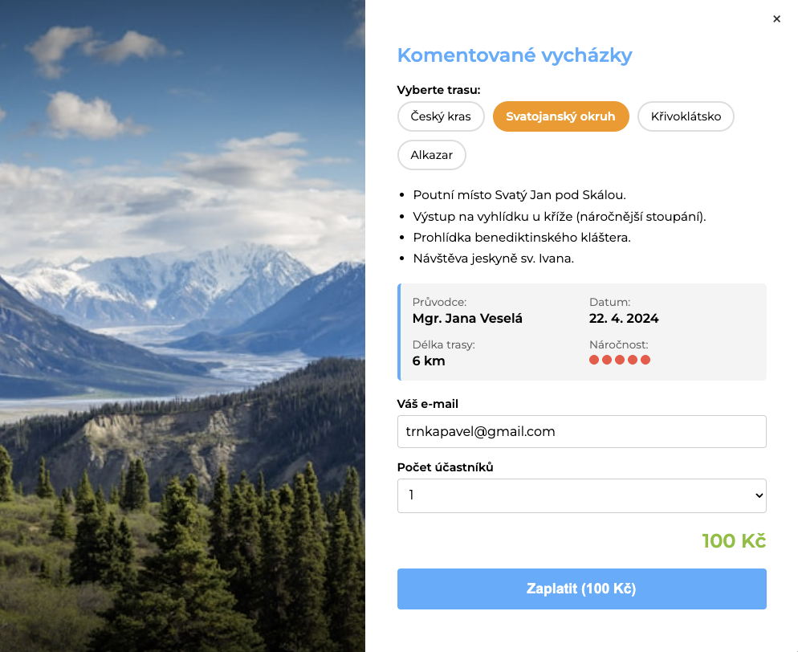

# 🥾 Berounsko.net - Rezervační Systém Vycházek

Interaktivní webová aplikace pro rezervaci komentovaných vycházek v oblasti Berounska. Uživatelé si mohou vybrat z nabízených tras, zadat počet účastníků a provést online rezervaci s automatickým odesláním potvrzovacího e-mailu.

## 🎯 Hlavní Funkce

- **Interaktivní výběr tras** - 4 různé vycházky s detailním popisem
- **Rezervační formulář** - Jednoduchý formulář s výpočtem ceny v reálném čase
- **Online platba** - QR kód pro snadnou platbu převodem (SPAYDformat)
- **Automatické e-maily** - Potvrzovací zprávy pro uživatele i správce
- **Google Sheets integrace** - Ukládání rezervací do tabulky
- **Responzivní design** - Funguje na mobilu, tabletu i desktopu

## � Náhled Aplikace



## �📋 Dostupné Vycházky

| Trasa | Délka | Cena | Náročnost |
|-------|-------|------|-----------|
| CHKO Český kras | 8,5 km | Zdarma | 🟠 Střední |
| Svatojanský okruh | 6 km | 100 Kč | 🔴 Těžká |
| CHKO Křivoklátsko | 11 km | 100 Kč | 🟢 Lehká |
| Alkazar | 5,5 km | 100 Kč | 🟢 Velmi lehká |

## 🛠️ Technologie

- **Frontend**: HTML5, CSS3, JavaScript (Vanilla)
- **Backend**: PHP 7.0+
- **Data**: JSON (rezervace_data.json)
- **Integrace**: Google Sheets API, SPAYDformat pro QR platby

## 📁 Struktura Projektu

```
berounsko/
├── index.php              # Hlavní stránka s modálním oknem
├── rezervace.php          # Backend pro zpracování rezervací
├── rezervace_data.json    # Lokální ukládat rezervací
├── screenshot/            # Screenshoty aplikace
│   └── screenshot.png     # Náhled aplikace
├── README.md             # Tato dokumentace
├── DOKUMENTACE.md        # Technická dokumentace
└── .gitignore            # Git ignore pravidla
```

## 🚀 Instalace a Spuštění

### Požadavky
- PHP 7.0 nebo vyšší
- Webový server (Apache, Nginx, PHP built-in server)
- E-mail (pro odesílání potvrzení)

### Lokální spuštění

1. **Klonování repozitáře**
```bash
git clone https://github.com/username/berounsko.git
cd berounsko
```

2. **Spuštění na localhostu (PHP built-in server)**
```bash
php -S localhost:8000
```

3. **Otevření v prohlížeči**
```
http://localhost:8000
```

### Nasazení na hosting

1. Uploads soubory na web server (přes FTP/SFTP)
2. Uprav e-mail v `rezervace.php` (řádek 5)
3. Uprav Google Apps Script URL (řádek 9)
4. Otestuj formulář

## ⚙️ Konfigurace

### Hlavní nastavení (rezervace.php)

```php
// Řádek 5 - E-mail správce
$adminEmail = "tvuj@email.com";

// Řádek 7-8 - IBAN pro platby
$rawIban = "CZ15 3030 0000 0011 4692 8017";

// Řádek 11 - Google Sheets integrace
$googleScriptUrl = "https://script.google.com/macros/s/YOUR_SCRIPT_ID/exec";
```

### Ceny tras

V souboru `index.php` (ve funkci `walks`) lze nastavit cenu pro každou trasu:

```javascript
'kras': {
    pricePerPerson: 0,      // Zdarma
    // ...
},
'svatojan': {
    pricePerPerson: 100,    // 100 Kč na osobu
    // ...
}
```

## 💳 Platební Systém

Aplikace generuje QR kódy ve formátu **SPAYD** (iniciativa ČNB pro standardizované platby).

- Uživatelé si nasnímají QR kód telefonem
- Bankovní aplikace se otevře s vyplněnou částkou
- Po potvrzení je rezervace platná

## 📧 E-maily

### Pro uživatele
- Potvrzení rezervace
- Platební údaje (QR kód + IBAN)
- Datum a čas vycházky

### Pro správce
- Nová objednávka
- Kontakt na uživatele
- Informace o platbě

## 🔄 Integrace s Google Sheets

Všechny rezervace se automaticky přidávají do Google Sheets tabulky:

1. Vytvoř Google Apps Script
2. Nastav jej na příjímání POST dat
3. Vlož URL do `$googleScriptUrl` v `rezervace.php`

Struktura dat:
```json
{
  "date": "2026-02-14 09:18:35",
  "walk": "Svatojanský okruh",
  "email": "user@example.com",
  "count": 3,
  "price": 300,
  "qr_link": "https://..."
}
```

## 🐛 Řešení Problémů

### E-maily se neposílají
- Zkontroluj e-mail správce v `rezervace.php`
- Zkontroluj, že server má povoleno odesílání e-mailů (PHP mail())

### QR kód se nezobrazuje
- QR kódy se generují přes `qrserver.com` API
- Potřebuje internetové připojení
- Zkontroluj IBAN na správný formát

### Google Sheets se nenaplňuje
- Zkontroluj URL v `$googleScriptUrl`
- Google Apps Script musí být publikován jako web app

## 📱 Responzivita

Aplikace je optimalizována pro:
- 📱 Mobilní zařízení (320px+)
- 📊 Tablety (768px+)
- 🖥️ Desktopy (1024px+)

## 👨‍💻 Vývoj

Projekt je napsán bez velkých frameworků pro snadnou údržbu a minimální závislosti.

### Schéma toku dat

```
Uživatel vyplní formulář
      ↓
JavaScript je ověří
      ↓
POST request na rezervace.php
      ↓
PHP zpracuje data
      ├→ Generuje QR kód
      ├→ Posílá do Google Sheets
      ├→ Odesílá e-mail uživateli
      ├→ Odesílá e-mail správci
      └→ Vrací JSON odpověď
      ↓
JavaScript zobrazí potvrzení
```

## 📝 Licence

MIT License - viz LICENSE soubor

## 👋 Kontakt a Podpora

- **Web**: https://www.berounsko.net
- **E-mail**: info@berounsko.net
- **GitHub**: https://github.com/username/berounsko

---

**Poslední aktualizace**: 14. února 2026
